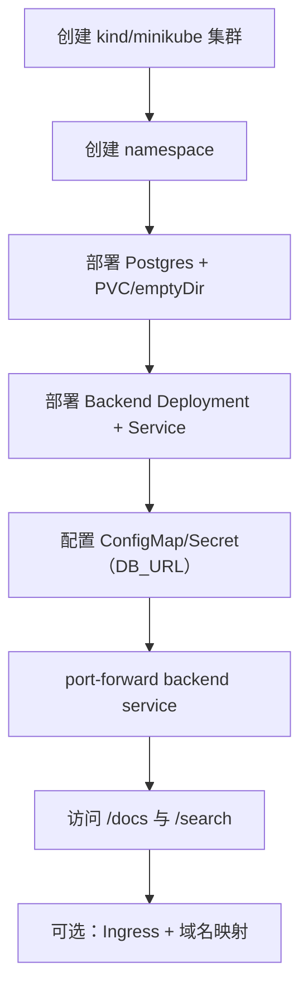
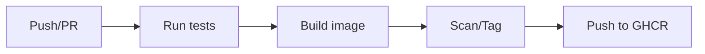

# Week 2（Day 6–10）本地 K8s 与 CI/CD 初版

## 本周目标

- 在本地搭建 kind 或 minikube 集群，跑通基础部署（backend / postgres / 可选 frontend）。
- 编写 K8s manifests 或 Helm chart（建议先 manifests，稳定后再抽 chart）。
- 调通 Ingress 或先用 `port-forward` 验证服务。
- 在 GitHub Actions 中加入：构建镜像 → 推送（GHCR）→ 跑后端测试（最小可用）。

## 交付物（验收清单）

- **本地 K8s**：`kubectl get pods` 全部 Ready；后端可通过 `port-forward` 访问 `/docs` 与 `/search`。
- **部署配置**：manifest/helm 具备可复用的 values（至少区分 dev）。
- **CI**：PR/Push 能自动跑测试；（可选）构建并推送镜像到 GHCR。

## 推荐推进顺序（Day 6–10）

- **Day 6：安装与创建集群**
  - kind/minikube 二选一；先跑通 `kubectl`。
- **Day 7：编写部署 manifests**
  - 优先 backend + postgres；再加 service/ingress。
- **Day 8：部署与网络调试**
  - 先 `port-forward`；再上 Ingress（降低变量）。
- **Day 9：GitHub Actions 初版**
  - 加入测试；再加构建/推送。
- **Day 10：CI 验证与自动部署（可选）**
  - 最小“自动部署”可先做到：CI 生成可用镜像 tag + 人工 apply。

## 操作步骤（建议）

### 1) 本地 K8s 部署路径（先简单后完整）

关键思考：
- **先 port-forward**：网络变量少，排障更快；Ingress 是“最后一公里”。
- **配置注入要统一**：本地 dev 与 CI 环境的 env/secret 格式要一致，避免“只在我机器上能跑”。

### 2) 配置与密钥（Secret）基本规范

- **明文配置**：ConfigMap（端口、log level、分页大小）
- **敏感配置**：Secret（DB 密码、GHCR token、第三方 webhook）
- **避免**：把敏感信息写进 git；或把本地 `.env` 硬编码到 manifest

### 3) CI/CD 初版建议（最小可用）

建议实现策略：
- **先测试**：测试稳定后再加镜像推送（否则排障点太多）。
- **镜像 tag**：用 commit sha（短 sha）保证可追溯。
- **缓存**：后续再加 build cache，先把流程打通。

## 常见问题与解决（Week 2 高频）

- **kind 集群拉镜像慢 / 拉不到**
  - **现象**：`ImagePullBackOff`
  - **解决**：
    - 先用公共基础镜像验证（不是你镜像的问题）
    - 本地构建的镜像需要 `kind load docker-image ...`
    - 检查代理/镜像仓库访问（公司网络常见）

- **Pod Ready 但服务访问不到**
  - **排查顺序**：
    - `kubectl get svc` 是否有 ClusterIP/端口正确
    - `kubectl port-forward svc/...` 是否成功
    - `kubectl logs` 看是否启动失败（尤其 DB 连接）
    - 探针（liveness/readiness）是否配置过严

- **Ingress 不生效**
  - **原因**：Ingress Controller 未安装或 className 不匹配
  - **解决**：
    - 先确认有 Ingress Controller（如 nginx-ingress）
    - 再确认 Ingress 里 `ingressClassName` 与 controller 一致
    - macOS 本地解析：用 `hosts` 或使用 `localhost` + NodePort

- **GHCR 推送权限问题**
  - **现象**：`denied: permission_denied`
  - **解决**：
    - repo 设置为 Public 或配置正确的 token 权限
    - Actions 使用 `GITHUB_TOKEN` 时需要开对应权限（packages）

- **CI 测试失败但本地成功**
  - **原因**：依赖缺失、环境变量不同、数据库不可用
  - **解决**：
    - 把测试尽量做成“可隔离”的（mock DB 或用临时 Postgres service）
    - 明确 CI 里需要的依赖（如 `httpx`）

## 本周复盘要点（建议记录）

- **部署最小闭环**：从 `kubectl apply` 到 `/docs` 可访问，中间每个环节如何验证
- **排障清单**：ImagePullBackOff / CrashLoopBackOff / 503 / Ingress 不通 的处理路径
- **CI 可靠性**：测试是否稳定，失败是否能快速定位原因

