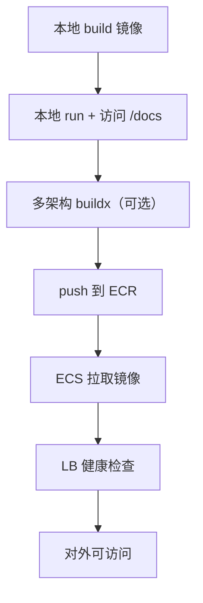
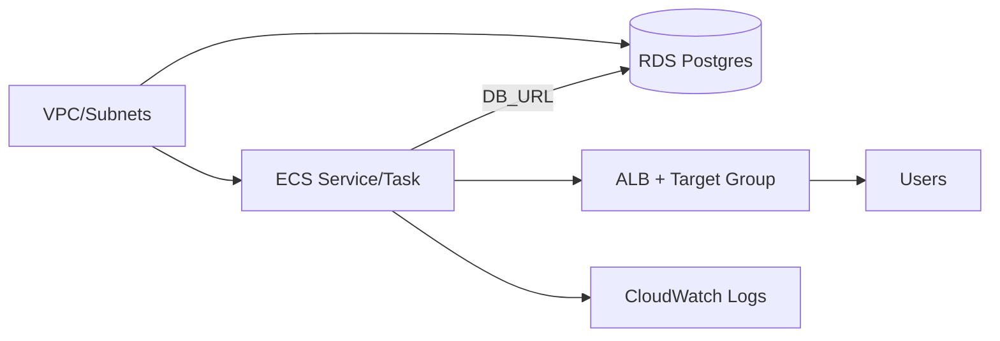

# Week 3（Day 11–15）容器化与 AWS 基础资源

## 本周目标

- 完善 Dockerfile（后端为主），支持多环境配置（dev/staging/prod 的差异最小化）。
- 推送镜像到 AWS ECR（最小权限、可追溯 tag）。
- 使用 ClickOps 在 AWS ECS 部署服务，连接 RDS，配置 LB（先跑通再优化）。
- 配置 Route53 域名解析，验证前端/后端可访问（至少后端健康检查通过）。
- 做一次端到端演示：创建文章 → 落库 → 搜索可查。

## 交付物（验收清单）

- **镜像**：后端镜像可在本地与 ECS 环境启动（通过健康检查）。
- **ECR**：能成功 push/pull（包含版本 tag）。
- **ECS + RDS**：服务稳定运行；DB 可连；基本监控可见（至少 logs）。
- **域名**：至少一个可访问入口（LB DNS 或 Route53 域名）。
- **E2E**：最少 1 条清晰可演示路径。

## 推荐推进顺序（Day 11–15）

- **Day 11：Dockerfile 与环境配置收敛**
- **Day 12：ECR 推送**
- **Day 13：ECS 部署 + RDS**
- **Day 14：Route53**
- **Day 15：端到端联调与演示脚本**

## 操作步骤（建议）

### 1) 镜像构建与多架构（macOS M1/M2 常见坑）

关键思考：
- 本地跑通 != 云上能跑（架构、依赖、端口、启动命令都可能不同）
- 尽量让镜像启动只依赖环境变量（不要依赖容器内文件状态）

常见策略：
- **tag 规范**：`service:gitsha` + `service:latest`（演示用）
- **配置**：通过 env 注入 DB_URL、CORS、log level

### 2) ECR 推送（最小闭环）

- 创建 ECR repository
- 配置 IAM 权限（最小化：push/pull）
- 登录并 push 镜像

风险点：
- **权限不足**：优先排 IAM policy 与 repository policy
- **区域不一致**：ECR region 与 CLI 配置一致

### 3) ECS + RDS（ClickOps 先跑通）

关键配置点：
- **网络**：ECS task 的子网、Security Group 必须允许到 RDS 端口
  - **健康检查**：LB health check path 建议使用专用 endpoint（例如本仓库的 `/api/health`）
- **日志**：开启 CloudWatch Logs，排障速度提升一个数量级

### 4) Route53（域名解析）

- **快速验证**：先用 ALB DNS 直接访问（排除 Route53 变量）
- **再上域名**：Route53 A/AAAA（Alias）指向 ALB

## 常见问题与解决（Week 3 高频）

- **M1/M2 镜像架构不匹配**
  - **现象**：ECS 拉取/启动失败，提示 `exec format error`
  - **解决**：构建多架构镜像（`linux/amd64` 与 `linux/arm64`），或至少与 ECS 运行环境一致

- **ECS 任务不断重启**
  - **排查顺序**：
    - 看 CloudWatch logs（是否启动参数/依赖缺失）
    - 检查健康检查 path 是否正确（别对 `/` 做严格校验）
    - 检查容器监听端口与 task definition 是否一致

- **连不上 RDS**
  - **原因**：Security Group、子网路由、RDS 公网/私网设置
  - **解决**：
    - ECS SG 放行到 RDS SG（入站规则）
    - 确认 RDS 与 ECS 在同 VPC 或有可达路由
    - 临时用 bastion/SSM 验证网络连通性

- **CORS 问题（前端访问后端被拦）**
  - **解决**：后端允许前端域名；本地与线上分别配置 allowed origins

- **域名解析生效慢**
  - **解决**：检查 TTL；先用 ALB DNS 验证服务可用；再确认 Alias 配置

## 本周复盘要点（建议记录）

- **云上排障路径**：logs/metrics/health check 的最短定位链路
- **配置收敛**：本地/CI/云上三套环境变量是否一致（命名、默认值）
- **演示脚本**：端到端路径要稳定（每次都能跑通）

