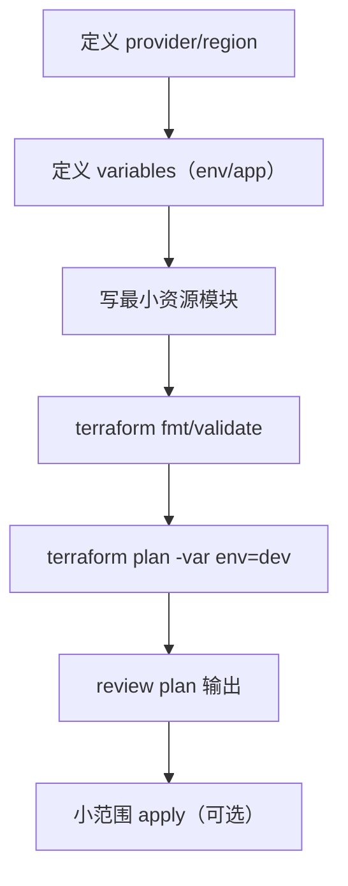
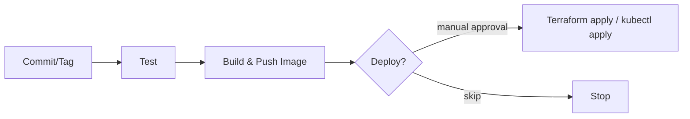

# Week 4（Day 16–20）IaC 与多环境部署

## 本周目标

- 编写 Terraform 最小模块（ECR/ECS/RDS/LB/Route53 任选你当前主线），先做到 `plan` 可通过。
- 把 CI 的 deploy 设计成可选：用环境变量/分支策略切换 dev/staging/prod。
- 做到“同镜像，多环境”部署：不同 namespace（K8s）或不同 ECS service（云上）。
- 加入基础健康检查与最小监控，准备演示脚本。

## 交付物（验收清单）

- **Terraform**：至少能对目标资源 `plan`；变量/outputs 清晰；状态管理有方案（本地 state 或远端 state）。
- **多环境**：dev 与 staging/prod 的资源隔离（名称、网络、DB、域名至少一种隔离方式）。
- **CI**：能选择性部署到指定环境（不强制自动 apply，先保证安全）。
- **可观测性**：有健康检查路径 + 基本日志查询方式。

## 推荐推进顺序（Day 16–20）

- **Day 16：Terraform 最小模块与 plan**
- **Day 17：CI 扩展为多环境（参数化）**
- **Day 18：Terraform 部署到 ECS/EKS（优先 ECS）**
- **Day 19：多环境隔离验证**
- **Day 20：健康检查 + 演示准备**

## 操作步骤（建议）

### 1) Terraform：先规范再扩展

关键思考：
- **先 plan 再 apply**：减少误操作，尤其在真实 AWS 账户里
- **模块化粒度**：从“可读”开始，不要一上来过度抽象
- **变量命名**：环境名（`env`）是主键，贯穿资源命名与标签

### 2) 多环境部署模式（推荐二选一）

- **模式 A：同一账户同一套代码，多 workspace / 多 state**
  - dev/staging/prod 通过不同 state 隔离资源
- **模式 B：目录隔离**
  - `infra/dev`、`infra/staging`、`infra/prod` 各自独立变量与 state

取舍建议：
- 初学/演示：目录隔离更直观
- 长期维护：workspace + 统一模块更省重复

### 3) CI：把“部署”变成可选且可追溯

关键点：
- **环境选择**：用分支（`main`->prod，`develop`->staging）或 workflow input
- **变更可追溯**：记录 image tag + terraform outputs（或 release notes）
- **安全**：默认只跑 plan；apply 需要显式触发（manual approval）

### 4) 健康检查与最小监控

- **健康检查 endpoint**：建议 `GET /api/health`（或同等轻量路径）只做最少依赖检查（进程活着 + 可选 DB ping）
- **日志**：
  - ECS：CloudWatch Logs
  - K8s：`kubectl logs` +（后续）集中式日志

## 常见问题与解决（Week 4 高频）

- **Terraform state 冲突/丢失**
  - **现象**：plan 结果异常、资源被“重新创建”
  - **解决**：
    - 尽快上远端 state（如 S3 + DynamoDB lock）
    - 或至少明确 state 文件的存放与备份策略

- **多环境资源命名冲突**
  - **解决**：统一加前缀/后缀（`app-env-*`），并用 tags 标识 `env`

- **CI 能部署但部署错环境**
  - **解决**：把 `env` 当成强校验输入（白名单 dev/staging/prod），并在 job 开头打印最终目标环境

- **健康检查导致服务被反复替换**
  - **原因**：健康检查过于严格（依赖 DB/外部服务）
  - **解决**：把 health check 分层：`/api/health`（轻）+ `/ready`（重，按需实现）

## 本周复盘要点（建议记录）

- **infra 结构**：目录/模块/变量如何组织，未来如何扩展
- **环境隔离**：哪些资源必须隔离，哪些可共享（如 ECR 可共享，DB 通常要隔离）
- **变更流程**：从提交到上线，每一步如何验证与回滚

