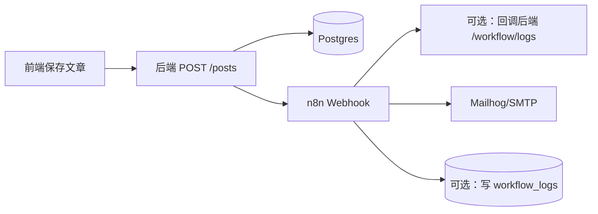
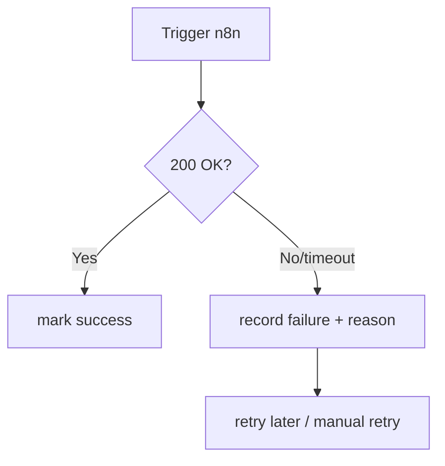

# Week 5（Day 21–25）n8n 集成

## 本周目标

- 本地搭建 n8n（docker-compose 或 K8s），跑通 webhook 触发。
- 在 n8n 创建工作流：HTTP Trigger →（可选）调用后端 API → 写 DB/日志 → 发邮件（本地 Mailhog）。
- 修改后端：文章创建后调用 n8n webhook（或由后端提供代理 `/workflow/trigger`）。
- 前端可展示工作流状态（最小：显示“已触发/失败/重试”）。
- 端到端测试并修复 CORS、网络、鉴权等问题。

## 交付物（验收清单）

- **n8n**：Webhook URL 可访问；触发后能在 n8n UI 看到执行记录（success/fail）。
- **后端**：创建文章后能触发工作流（同步或异步均可，但要可观测）。
- **邮件**：本地 Mailhog 能收到模拟邮件（或至少看到发送步骤执行）。
- **状态**：后端存储或返回 workflow 状态/日志（最小可用）。

## 推荐推进顺序（Day 21–25）

- **Day 21：搭建 n8n（本地）**
- **Day 22：创建 webhook 工作流**
- **Day 23：后端调用 n8n webhook**
- **Day 24：前端展示工作流状态**
- **Day 25：端到端排障与加固**

## 操作步骤（建议）

### 1) 本地 n8n 工作流（最小闭环）



关键思考：
- **触发方式**：后端主动调用 n8n webhook（简单）；或前端直接触发（风险更高，不推荐）。
- **同步 vs 异步**：
  - 同步：用户请求会等 n8n 返回，体验可能变差
  - 异步：后端先返回创建成功，再异步触发（需要任务队列/后台任务/重试策略）

建议策略（演示优先）：
- Week 5 先实现“创建后同步触发”（可快速看到效果）
- 再补“超时/失败不影响创建”的容错（例如后台任务 + 记录失败）

### 2) n8n 工作流设计（推荐节点）

- **HTTP Trigger**：接收 `post_id` / `title` / `tags` 等
- **HTTP Request（可选）**：回调后端获取更完整文章内容
- **Function/Set**：拼接邮件内容/模板变量
- **Email**：连接 Mailhog/SMTP 发送
- **Postgres（可选）**：写 workflow 日志（或改由后端写）

```mermaid
flowchart TD
  W[Webhook Trigger] --> V[Validate/Normalize]
  V --> G[Get Post (optional)]
  G --> T[Template Email Body]
  T --> E[Send Email]
  E --> L[Log Result]
```

### 3) 后端触发 n8n 的接口设计

两种常见方式：
- **方式 A：创建文章后直接调用 n8n webhook**
  - 优点：实现快
  - 缺点：耦合 n8n URL；需要重试/超时策略
- **方式 B：后端提供 `/workflow/trigger` 统一代理**
  - 优点：后续可加鉴权、限流、重试、日志
  - 缺点：比方式 A 多一层实现

建议（长期可维护）：方式 B 更清晰；Week 5 可先 A 后 B。

### 4) 失败处理与重试（最少要有）

- **超时**：n8n webhook 调用设置合理超时（避免卡死用户请求）
- **重试**：失败记录入库，提供“重试”按钮/接口（后续扩展）
- **幂等**：同一 `post_id` 重复触发不要产生重复副作用（例如邮件重复发送）



## 常见问题与解决（Week 5 高频）

- **CORS：前端调用后端被拦**
  - **解决**：后端明确允许前端域名（dev/staging/prod 分开配置）

- **n8n 与后端网络不通（Compose/K8s）**
  - **原因**：服务名/网络不一致，或端口映射错误
  - **解决**：
    - Compose：使用服务名互访（`http://backend:8000`、`http://n8n:5678`）
    - K8s：使用 Service DNS（`http://backend.default.svc.cluster.local`）

- **Webhook 触发成功但节点失败**
  - **解决**：在 n8n UI 看执行日志（每个节点输入/输出）；把失败原因写入 workflow log

- **邮件发送失败**
  - **原因**：SMTP 配置、端口、TLS 设置不匹配
  - **解决**：本地先用 Mailhog（最小变量），确认能收到再换真实邮件服务

- **重复触发导致重复邮件**
  - **解决**：引入幂等键（如 `post_id + action`），n8n 或后端检查已执行则跳过

## 本周复盘要点（建议记录）

- **工作流边界**：哪些逻辑放后端，哪些放 n8n（以及原因）
- **可靠性**：失败是否可见、可重试、可追踪（trace id / execution id）
- **安全**：webhook 是否需要 token（避免公网被刷）


