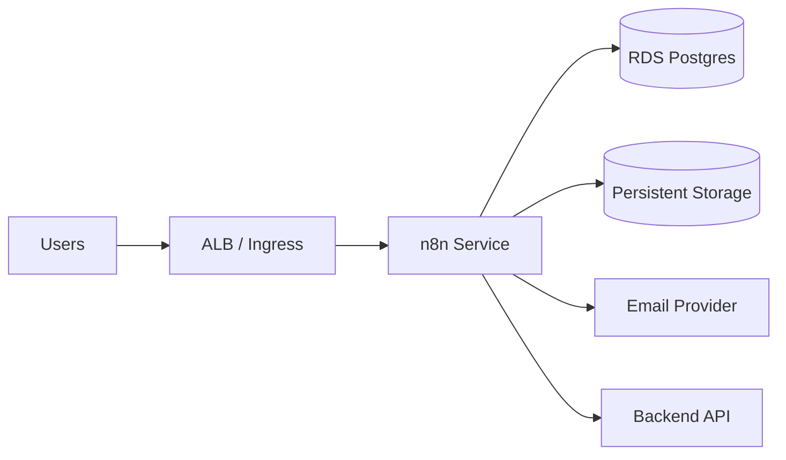
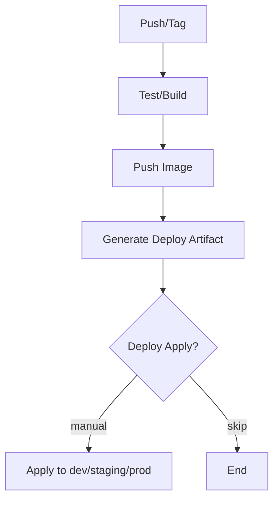
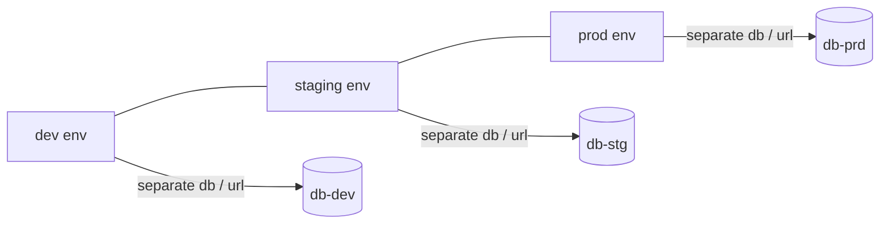

# Week 6（Day 26–30）云上 n8n 与最终交付

## 本周目标

- 将 n8n 部署到云上（ECS/EKS 任选主线），配置持久化存储（避免重启丢数据）。
- 在 CI/CD 中加入 n8n 部署步骤（至少能构建、推送、生成部署工件；apply 可选）。
- 配置 n8n 与 RDS、邮件服务（SES/Mailhog 替换为真实服务或保留演示环境）。
- 多环境下验证工作流（dev/staging/prod），确保隔离与可回滚。
- 准备最终交付：PPT、演示视频、FAQ、故障演练脚本、仓库整理。

## 交付物（验收清单）

- **云上 n8n**：可登录 UI；Webhook 可被触发；执行记录可追踪。
- **持久化**：n8n 关键数据（工作流/凭证/执行记录）不因重启丢失。
- **邮件/外部服务**：至少一个真实链路可用（或明确演示环境限制）。
- **多环境**：同镜像在不同环境部署，互不影响（至少数据与 webhook 隔离）。
- **最终材料**：演示脚本 + FAQ + 架构图 + 已知问题与规避方案。

## 推荐推进顺序（Day 26–30）

- **Day 26：云上部署 n8n + 存储**
- **Day 27：CI 加入 n8n 部署流水线**
- **Day 28：打通 RDS + 邮件服务**
- **Day 29：多环境验证**
- **Day 30：最终交付整理与演示**

## 操作步骤（建议）

### 1) 云上 n8n 架构（最小可用）

关键思考：
- **存储**：n8n 本身需要持久化（工作流/凭证/执行记录）；不要把它当无状态服务
- **网络**：webhook 对外暴露，管理界面建议加鉴权/限制访问来源
- **安全**：webhook token、基础认证、IP allowlist（能做多少做多少，至少要有 token）

### 2) CI/CD（云上 n8n）

实践建议：
- 先把 n8n 镜像与部署清单生成出来（可审计）
- apply 用手动门禁（尤其 prod）

### 3) 多环境验证清单（dev/staging/prod）

- **隔离**：
  - webhook base URL 不同（域名或 path 前缀）
  - n8n 数据库/schema 不同
  - 后端回调地址不同
- **可回滚**：
  - 镜像 tag 可回退
  - workflow 变更有导出备份（n8n 支持导出）

## 常见问题与解决（Week 6 高频）

- **n8n 重启后工作流/凭证丢失**
  - **原因**：未配置持久化卷/外部数据库
  - **解决**：使用外部 Postgres + 持久化存储（按部署平台选择 EBS/EFS/PVC）

- **Webhook 被公网乱打（安全风险）**
  - **解决**：
    - webhook URL 加 token（至少）
    - 对管理界面加 Basic Auth / SSO / IP 限制
    - 加入简单限流与告警（后端或网关层）

- **邮件服务在云上失败（SES/SMTP）**
  - **原因**：凭证、区域、沙箱限制、端口/TLS
  - **解决**：
    - 先验证 provider 的最小发送样例
    - 再把配置注入到 n8n（密钥用 Secret 管理）

- **多环境串库/串 webhook**
  - **解决**：把 `ENV` 当作强约束，所有 URL/DB/schema 都必须显式包含 env；上线前做 checklist 核对

## 最终交付建议（Day 30）

- **演示脚本（3–5 分钟）**
  - 搜索 → 创建文章 → 触发工作流 → 邮件/日志 → 前端展示状态
- **PPT 结构**
  - 架构图（组件与数据流）
  - 关键技术点（CI/CD、多环境、n8n）
  - 踩坑与解决（3–5 个最典型）
  - 下一步路线图（性能、安全、观测、权限）
- **FAQ（建议包含）**
  - CORS/网络/权限/回滚/成本控制

